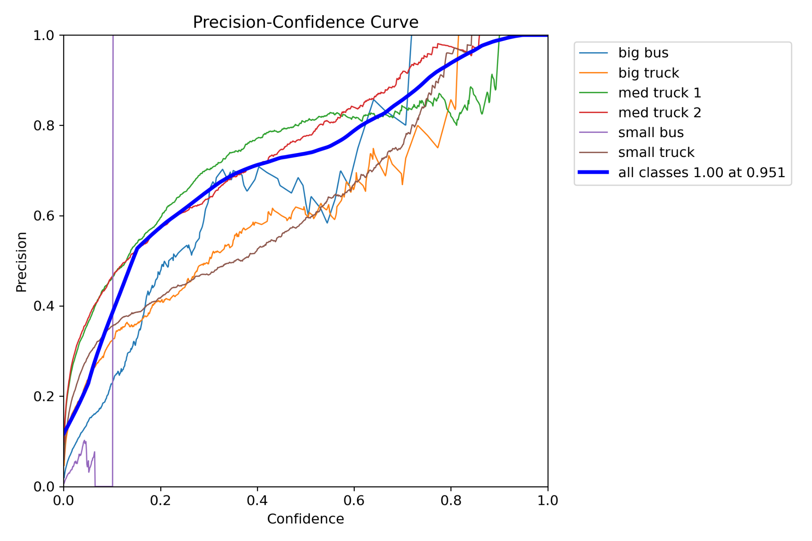
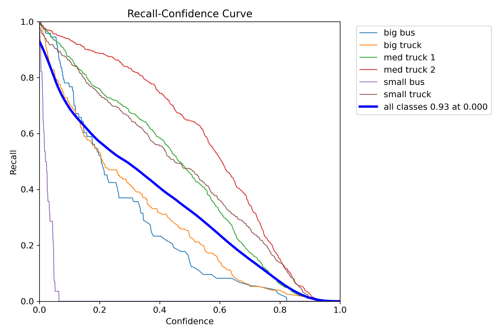
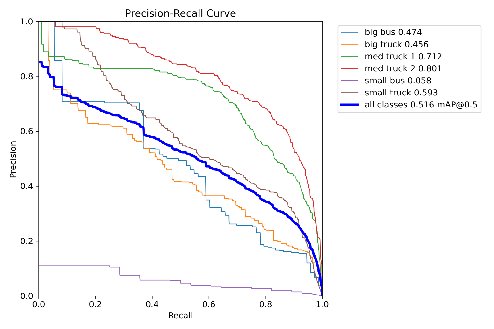
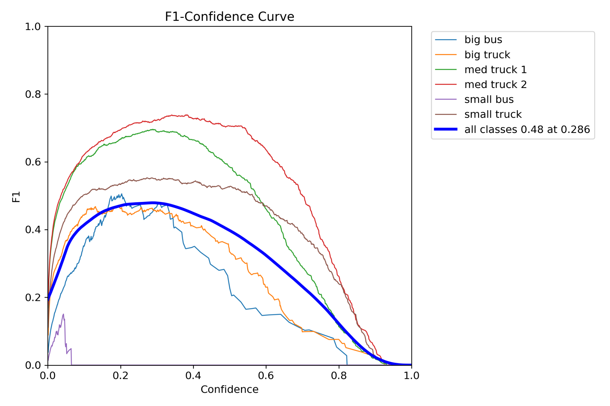
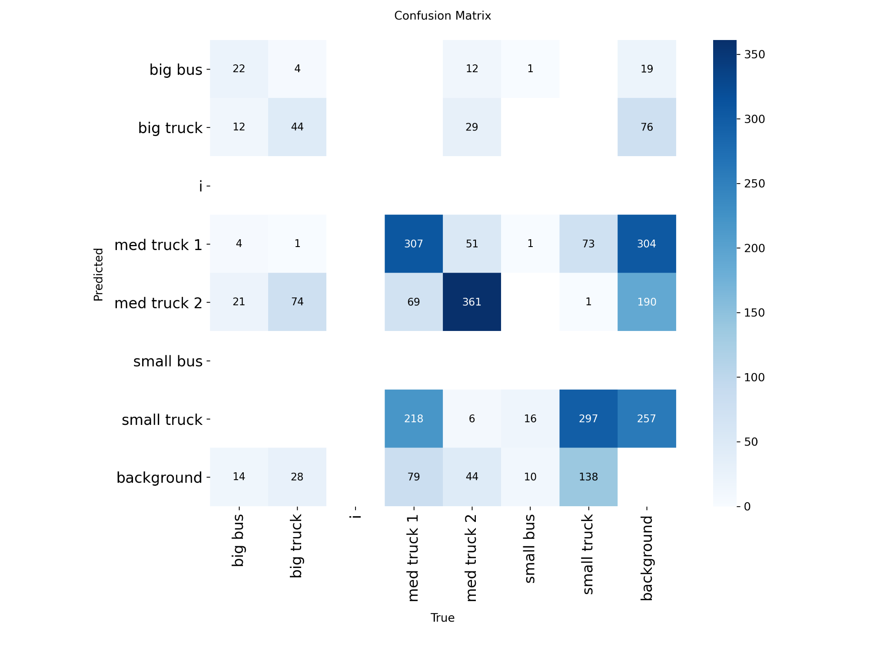
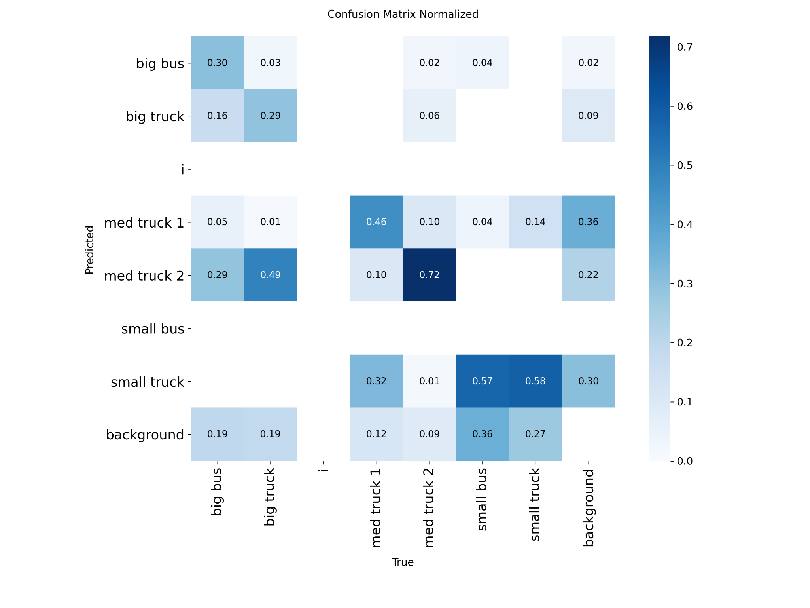
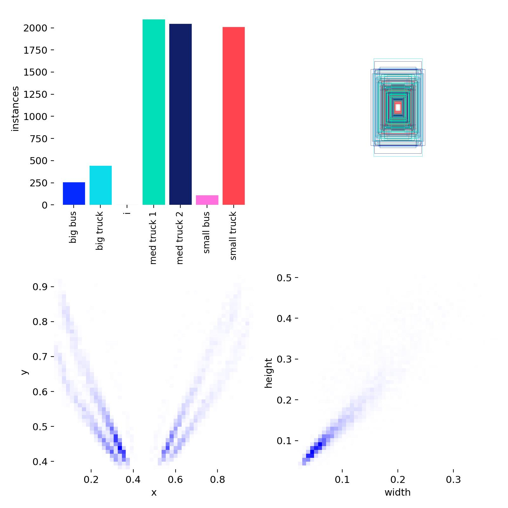
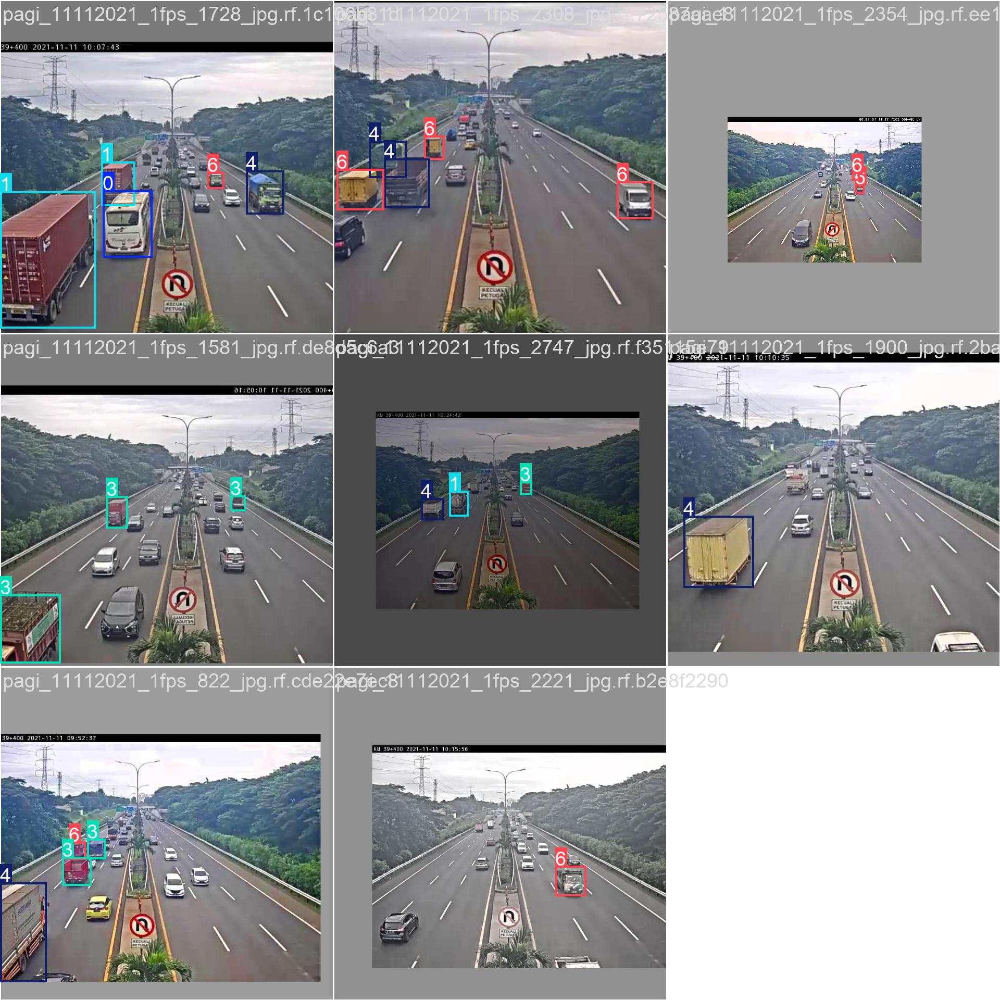
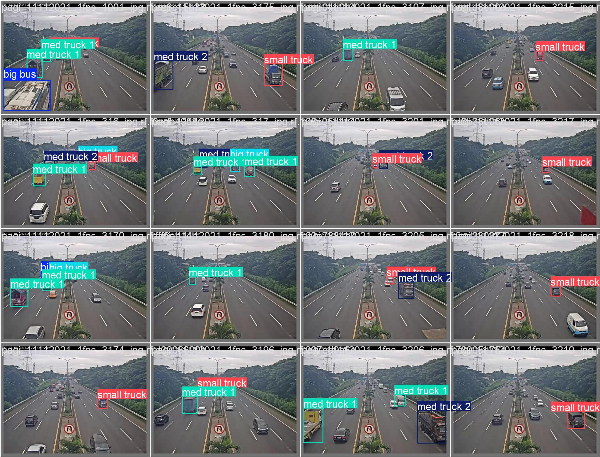

# 🚗 Vehicle Detection using YOLOv5

This project presents a real-time **Vehicle Detection System** built using the YOLOv5 object detection framework. The system is trained on a custom dataset of traffic images and aims to accurately detect and localize vehicles such as cars, bikes, buses, and trucks in diverse environments.

---

## 📌 Description

Vehicle detection plays a crucial role in intelligent traffic systems, surveillance, autonomous driving, and parking management. Traditional detection algorithms often struggle with dynamic road conditions, variable lighting, and occlusions.

In this project, we fine-tuned the YOLOv5 model on a custom dataset tailored for traffic scenarios. By leveraging YOLOv5’s speed and accuracy, the model delivers real-time object detection performance with high precision and recall.

---

## 🎯 Key Features

- Custom-trained YOLOv5 model for vehicle detection
- Real-time inference capability
- Supports detection of multiple vehicle types
- Evaluated using precision-recall curves and confusion matrices
- Visual samples for dataset labeling and training batches

---

## 🚀 Applications

- **Smart Traffic Monitoring**: Detect and count vehicles to analyze congestion.
- **Parking Lot Management**: Detect vacant and occupied spots.
- **Surveillance**: Enhance security through vehicle activity analysis.
- **Autonomous Driving**: Act as a perception module for identifying nearby vehicles.
- **Toll Booth Automation**: Automate detection and classification of vehicles at toll stations.

---
---

## 📊 Results and Visualizations

### 🔹 Precision-Recall and F1 Score Curves

| Precision | Recall | PR Curve | F1 Score |
|----------|--------|----------|----------|
|  |  |  |  |

### 🔹 Confusion Matrices

| Raw Confusion Matrix | Normalized Confusion Matrix |
|----------------------|-----------------------------|
|  |  |

### 🔹 Dataset Labels and Batches

| Label Distribution | Training Batch | Validation Batch |
|--------------------|----------------|------------------|
|  |  |  |

---

---
